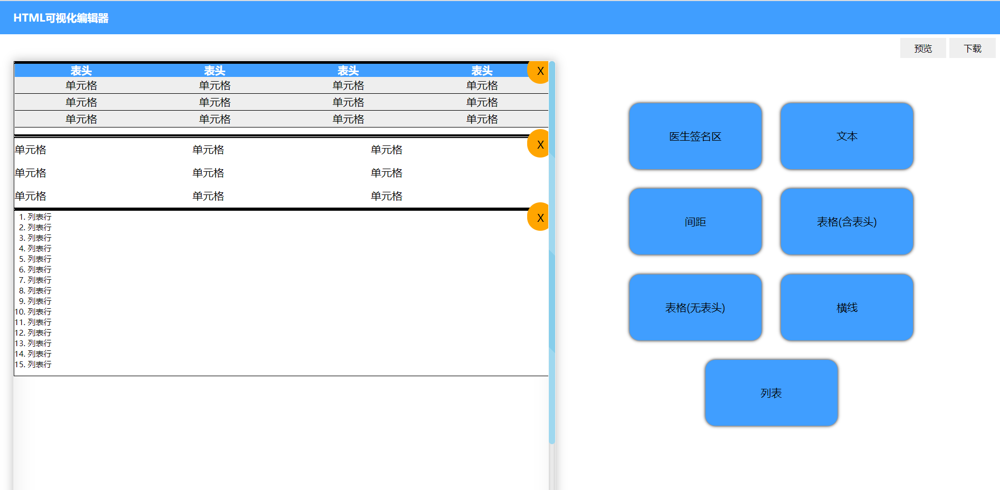

# HTML5可视化编辑器

## 介绍
在项目中为了更方便地生成报告的html页面，开发了一个可视化生成html的工具。可通过拖动相应组件到预览框中，自动生成html代码

## 构成
html界面、drag.js中实现拖拽函数、预览及下载html代码

## drag.js 拖拽函数
1. 监听 dragstart 事件，判断拖动块的类型
2. 监听 drop 事件，不同模块拖入时添加相应代码模板
3. 对于 text 文本模块来说，通过ueditor模块来编辑文字格式

## 下载
1. 取到容器中的代码
2. 添加 html 的头部及尾部

## 预览
